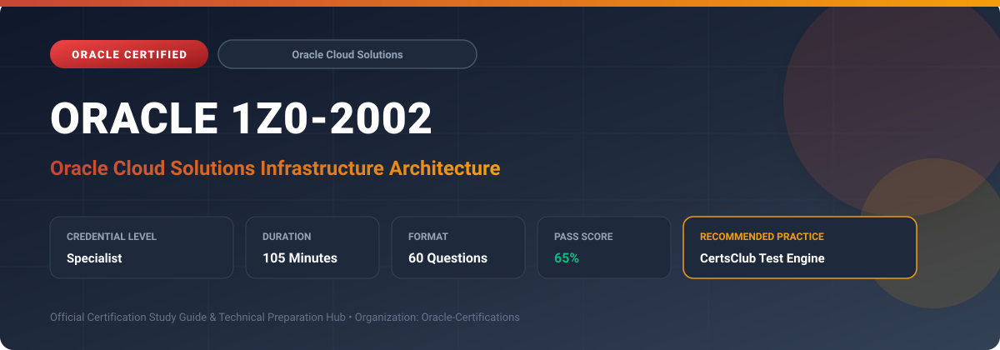

  

# Oracle 1Z0-2002: Oracle Cloud Solutions Infrastructure Architecture

---

## 1. Exam Overview & Candidate Profile

The **Oracle 1Z0-2002: Oracle Cloud Solutions Infrastructure Architecture** credential certifies professionals who demonstrate technical mastery, architectural competence, and hands-on operational capability in this certification domain.

Candidates validate comprehensive knowledge and expertise required to design, configure, manage, and optimize mission-critical Oracle environments across cloud, on-premises, and hybrid architectures.

### Target Audience & Prerequisites
- **Target Roles**: Implementation Specialists, Cloud Architects, Technical Leads, Enterprise Consultants, and Systems Engineers.
- **Recommended Experience**: 1–2 years of practical, hands-on experience designing, implementing, and maintaining corresponding Oracle solutions.
- **Credential Earned**: Specialist Certification.

---

## 2. Key Exam Specifications

| Specification | Details |
| :--- | :--- |
| **Exam Code** | **Oracle 1Z0-2002** |
| **Official Title** | Oracle Cloud Solutions Infrastructure Architecture |
| **Certification Track** | Oracle Cloud Solutions |
| **Exam Duration** | 105 Minutes |
| **Number of Questions** | 60 Questions |
| **Passing Score** | 65% |
| **Question Format** | Multiple Choice (Single/Multiple Answer), Scenario-Based Questions |
| **Delivery Provider** | Oracle University / Pearson VUE (Online Proctored or Test Center) |
| **Recommended Practice Engine** | [CertsClub Oracle Practice Tests](https://www.certsclub.com/oracle/1z0-2002-dumps.html) |

---

## 3. Official Blueprint & Exam Domain Breakdown

The examination assesses candidate competencies across core functional domains weighted as follows:

| Domain Area | Weighting |
| :--- | :--- |
| **End-to-End Enterprise Cloud Solution Design** | `25%` |
| **High Availability, Disaster Recovery & Multi-Region Topology** | `25%` |
| **Hybrid Cloud Connectivity & Multi-VCN Network Topology** | `20%` |
| **Workload Migration, Security Compliance & Isolation** | `15%` |
| **Cost Governance, SLA Compliance & Operational Excellence** | `15%` |

---

## 4. Deep Dive into Complex & Challenging Technical Topics

To secure a passing score on the 1Z0-2002 exam, candidates must master the following advanced concepts:

- Architecting highly available mission-critical enterprise workloads across multi-region and multi-availability domain topologies.
- Designing hub-and-spoke VCN network architectures using Dynamic Routing Gateways (DRG v2) and Network Firewalls.
- Planning hybrid disaster recovery strategies: active-active, warm standby, and pilot light with cross-region replication.
- Structuring tenancy governance: multi-tiered compartment hierarchies, policy boundaries, and security zone baselines.
- Optimizing enterprise total cost of ownership (TCO) through architectural sizing, autoscaling, and storage tiering.

---

## 5. Scenario-Based Demo & Practice Questions

### Question 1
In a large multi-VCN enterprise topology on OCI, which centralized routing component simplifies transitive routing between multiple VCNs and on-premises FastConnect circuits?

A) Dynamic Routing Gateway (DRG v2) with Route Tables
B) Internet Gateway
C) NAT Gateway
D) Service Gateway

- **Correct Answer**: `A) Dynamic Routing Gateway (DRG v2) with Route Tables`  
- **Technical Explanation**: DRG v2 provides advanced routing capabilities, allowing multiple VCNs, FastConnect circuits, and IPSec VPNs to route traffic transitively through distinct DRG route tables.

---

### Question 2
To achieve a Recovery Point Objective (RPO) near zero for an Oracle Database across two OCI regions, which replication technology must be deployed?

A) Oracle Data Guard in synchronous or far sync configuration
B) Weekly Object Storage lifecycle backups
C) Manual scp file transfer
D) Compute instance volume snapshots every 24 hours

- **Correct Answer**: `A) Oracle Data Guard in synchronous or far sync configuration`  
- **Technical Explanation**: Oracle Data Guard replicates redo data synchronously or via Far Sync instances between primary and standby databases, delivering near-zero RPO disaster recovery.

---

## 6. Recommended Preparation Strategy & Practice Testing Engine

Achieving certification in **Oracle 1Z0-2002** requires balanced theoretical study and scenario-based simulation practice:

1. **Review Oracle Documentation**: Master architecture guides, implementation workbooks, and administration manuals on the Oracle Help Center.
2. **Hands-on Lab Practice**: Execute real-world configuration, policy setup, and troubleshooting tasks in your cloud tenancy or test instance.
3. **Simulated Exam Drills**: Practice answering timed, scenario-based multiple-choice questions to familiarize yourself with the question formats, traps, and timing constraints.

### Practice With CertsClub
For realistic practice questions, updated dumps, and mock testing environments:
- **Resource**: [CertsClub Oracle Practice Test Engine](https://www.certsclub.com/oracle/1z0-2002-dumps.html)
- **Special Discount**: Use coupon code **`club20`** during checkout for an instant **20% discount** on all practice exam bundles and testing engines.

---

## 7. Official Documentation & References

- [Oracle University Certification Registry](https://education.oracle.com/)
- [Oracle Help Center Documentation Portal](https://docs.oracle.com/)
- [Oracle Cloud Infrastructure & Applications Guides](https://docs.oracle.com/en/cloud/)
- [CertsClub Oracle Certification Exam Practice](https://www.certsclub.com/oracle/1z0-2002-dumps.html)

---

## 8. SEO & Discovery Keywords

`oracle 1z0-2002, oracle 1z0-2002 exam, oracle 1z0-2002 dumps, 1Z0-2002 practice questions, 1Z0-2002 study guide, oracle cloud solutions infrastructure architecture, certsclub 1z0-2002`